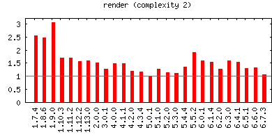
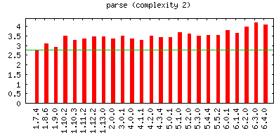
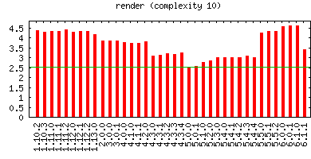
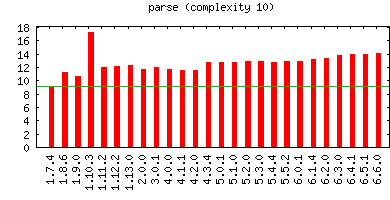
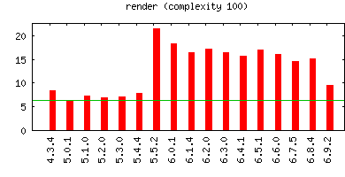
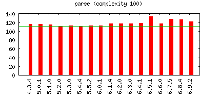

# GRMustache benchmarks

You can here compare the performance of [GRMustache](https://github.com/groue/GRMustache) versions.

GRMustache has been tested against random templates containing 2, 10, or 100 elements (text, `{{variable}}` tags, or `{{#section}}` tags).

Parsing and rendering tasks are measured separately.

Numbers have no unit: they are all relative to the time taken by the shortest task, which is given the score 1.

<table border="0" cellspacing="0" cellpadding="0">
<tr>
<td>

</td>
<td>

</td>
</tr>
<tr>
<td>

</td>
<td>

</td>
</tr>
<tr>
<td>

</td>
<td>

</td>
</tr>
</table>

## Rendering task

	                 2       10      100
	v6.4.0     1.4e+00  3.4e+00  2.8e+01
	v6.3.0     1.3e+00  3.4e+00  2.6e+01
	v6.2.0     1.3e+00  3.4e+00  2.6e+01
	v6.1.4     1.3e+00  3.3e+00  2.5e+01
	v6.0.1     1.7e+00  4.9e+00  4.6e+01
	v5.5.2     1.7e+00  4.5e+00  4.1e+01
	v5.4.4     1.2e+00  3.3e+00  2.3e+01
	v5.3.0     1.2e+00  3.1e+00  2.3e+01
	v5.2.0     1.1e+00  2.9e+00  2.1e+01
	v5.1.0     1.1e+00  2.9e+00  2.1e+01
	v5.0.1     1.0e+00  2.8e+00  1.9e+01
	v4.3.4     1.2e+00  3.2e+00  2.8e+01
	v4.2.0     1.2e+00  3.8e+00  3.4e+01
	v4.1.1     1.3e+00  4.0e+00  3.2e+01
	v4.0.0     1.3e+00  3.8e+00  3.3e+01
	v3.0.1     1.3e+00  4.0e+00  3.4e+01
	v2.0.0     1.3e+00  3.9e+00  3.3e+01
	v1.13.0    1.4e+00  4.2e+00  3.7e+01
	v1.12.2    1.5e+00  4.5e+00  3.9e+01
	v1.11.2    1.4e+00  4.6e+00  4.0e+01
	v1.10.3    1.4e+00  4.5e+00  4.1e+01
	v1.10.2    1.5e+00  4.7e+00  4.3e+01
	v1.9.0     2.6e+00  9.2e+00  8.8e+01
	v1.8.6     2.4e+00  9.0e+00  8.5e+01
	v1.7.4     2.2e+00  8.0e+00  7.8e+01

## Parsing task

	                 2       10      100
	v6.4.0     4.1e+00  1.4e+01  1.3e+02
	v6.3.0     4.2e+00  1.3e+01  1.3e+02
	v6.2.0     4.0e+00  1.3e+01  1.3e+02
	v6.1.4     3.7e+00  1.3e+01  1.3e+02
	v6.0.1     3.8e+00  1.3e+01  1.3e+02
	v5.5.2     3.5e+00  1.3e+01  1.3e+02
	v5.4.4     3.5e+00  1.3e+01  1.2e+02
	v5.3.0     3.5e+00  1.3e+01  1.2e+02
	v5.2.0     3.6e+00  1.3e+01  1.2e+02
	v5.1.0     3.7e+00  1.3e+01  1.3e+02
	v5.0.1     3.4e+00  1.3e+01  1.3e+02
	v4.3.4     3.4e+00  1.2e+01  1.3e+02
	v4.2.0     3.5e+00  1.2e+01  1.1e+02
	v4.1.1     3.3e+00  1.2e+01  1.1e+02
	v4.0.0     3.3e+00  1.1e+01  1.1e+02
	v3.0.1     3.5e+00  1.2e+01  1.1e+02
	v2.0.0     3.4e+00  1.2e+01  1.1e+02
	v1.13.0    3.5e+00  1.2e+01  1.2e+02
	v1.12.2    3.5e+00  1.2e+01  1.1e+02
	v1.11.2    3.4e+00  1.1e+01  1.1e+02
	v1.10.3    3.3e+00  1.2e+01  1.1e+02
	v1.10.2    3.5e+00  1.2e+01  1.2e+02
	v1.9.0     2.9e+00  8.9e+00  8.3e+01
	v1.8.6     3.1e+00  9.0e+00  8.2e+01
	v1.7.4     2.8e+00  8.9e+00  8.2e+01

-----

This README.md file has been generated with the `make` command.

